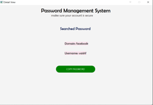

# Password Managment System #

**Problem to solve?**

One problem we face in our day-to-day life, and we believe most other people do as well, is remembering unique passwords for every online site. In this hustle and bustle of life, where we have to remember a lot of things, remembering a password becomes challenging. Since every site, such as bank logins, social media, e-commerce websites, company logins, and many more, requires a unique password, we often end up us.

**What is the idea to solve the problem?**

An idea to solve this problem is to build a password management system
where we can securely store and retrieve encrypted passwords. In addition to
storing and retrieving passwords, this system will also feature Password
Generation, which will suggest strong and random passwords.

**Who can benefit from this?**

Anyone who values security and has a hard time remembering multiple passwords and dislikes resetting passwords frequently. With the **Password Management System (PMS)**, you no longer need to rely on memory or risk using weak passwords. I believe it's a good idea because it encourages the use of strong, unique passwords for each account, eliminates the need to memorize numerous passwords or resort to writing them down (which can be insecure), and helps protect against phishing attacks by storing passwords in an encrypted format, reducing the risk of unauthorized access. Passwords remain secure and easily accessible only to you. 

**In the future scope**, this system could be developed as a browser extension, enabling it to automatically fill in login credentials, streamlining the login process for a seamless user experience. It can also notify users when it's time to change their passwords, ensuring their accounts stay up-to-date.

## Technologies used in this project

1. Java
2. JFX
3. SceneBuilder
4. OOD

## Screen Shots of Password Managment System
### Login Page      
 

### Registration Page
 

### Main Page    

### Add New Password     

### Edit Password 

### Generate Password

### Search Password

### Get Searched Passord

### Alert Notification

## Demo

[Demo - Password Management System](Password_Management_System-Demo.pptx)

## Instructions To Run The Project

1. Ensure that the `users.txt` file is present in the `dataFile` folder if not, create a empty txt file in `dataFile` folder.
2. Add `--add-modules javafx.controls,javafx.fxml` to your Run configuration.
3. Right-click on the project and select "Run as Java Application".
4. You will be directed to the Password Management Login Page.
5. To view password, right click on the project click refresh button
6. Password gets stored with the login user_name.txt in `dataFile`

**Note**: If you encounter a warning related to JavaFX version differences, such as "Loading FXML document with JavaFX API of version 20.0.1 by JavaFX runtime of version 17.0.8", you can safely ignore this warning.